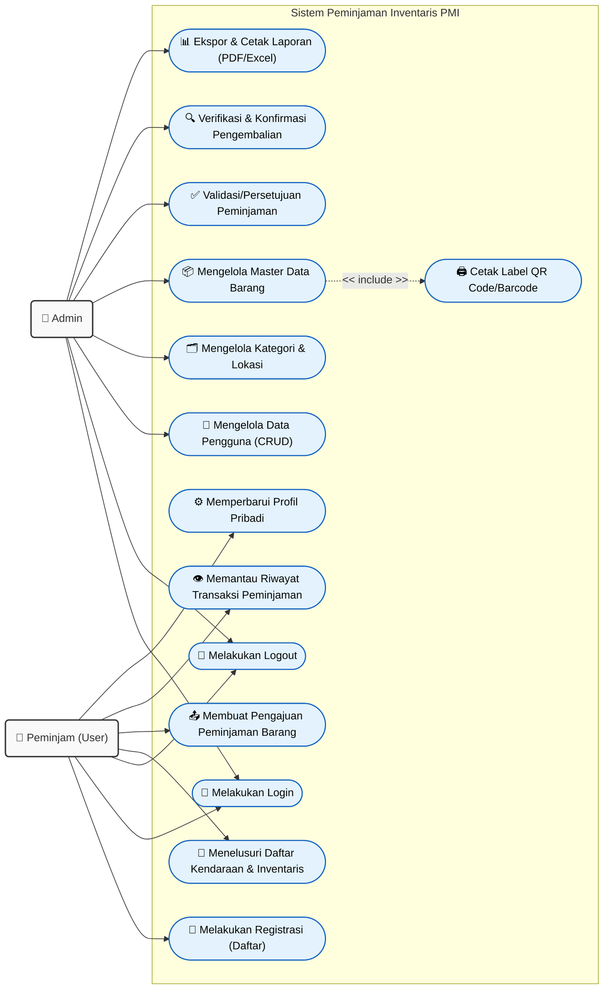

# BAB III
# ANALISIS DAN PERANCANGAN SISTEM

## 3.1 Analisis Kebutuhan Sistem
Berdasarkan hasil observasi dan wawancara terkait proses pencatatan inventaris di Palang Merah Indonesia (PMI) Kota Semarang, dirancanglah sebuah sistem informasi berbasis web untuk mendigitalisasi sirkulasi barang logistik. Sistem ini membagi hak akses ke dalam dua tipe aktor utama, yaitu **Admin** dan **User (Peminjam)**. Masing-masing aktor memiliki kapabilitas fungsional yang berbeda namun saling berinteraksi untuk mencapai siklus manajemen inventaris yang valid.

### 3.1.1 Identifikasi Aktor (Pengguna)
Batasan dan deskripsi dari aktor pengguna disajikan sebagai berikut:

1. **Admin**
   Admin adalah staf logistik atau pihak pengelola inventaris gudang PMI. Admin bertugas menegakkan keakuratan data (master data), melakukan verifikasi peminjaman barang, memantau pengembalian, mencetak QR Code, serta memverifikasi ketersediaan barang secara fisik di gudang. Admin memegang akses penuh ke seluruh *resource* sistem.
   
2. **User (Peminjam)**
   Peminjam mencakup relawan, anggota KSR/TSR, atau pemohon divisi lain yang membutuhkan sarana prasarana logistik dan inventaris PMI (seperti tenda peloton, timbangan bed, dsb.) untuk bertugas. User memerlukan antarmuka yang intuitif untuk mendaftar, memilih barang, dan memantau status persetujuannya.

### 3.1.2 Identifikasi Proses (Kebutuhan Fungsional)
Sistem dirancang sedemikian rupa sehingga mengakomodasi transaksi peminjaman barang sejak awal (hulu) hingga pengembalian (hilir). Adapun rincian *Use Case* dijabarkan di bawah ini:

**A. Kebutuhan Fungsional Aktor "Admin"**
* Admin dapat melakukan proses otentikasi (**Login**).
* Admin dapat mengelola master akun pengguna / peminjam (**Kelola Data Pengguna**).
* Admin dapat memperbarui klasifikasi kategori dan peta lokasi penyimpanan barang di gudang (**Kelola Kategori & Lokasi**).
* Admin dapat menginputkan barang baru, mengubah data kelayakan, dan menambah kuantitas barang ke dalam sistem (**Kelola Barang / Inventaris**).
* Admin dapat melakukan pengkodean aset logistik secara masif dengan fungsi mencetak barcode (**Cetak QR Code**).
* Admin menerima notifikasi peminjaman yang *pending* (menggantung), kemudian mempertimbangkannya untuk **Disetujui** atau **Ditolak** (**Verifikasi Peminjaman**).
* Admin dapat mengonfirmasi penutupan siklus peminjaman apabila barang telah benar-benar dikembalikan utuh (**Konfirmasi Pengembalian**).
* Admin dapat mem-filter tanggal untuk mengekspor sirkulasi keluaran/masukan barang dalam format cetak digital (**Cetak Laporan PDF / Excel**).

**B. Kebutuhan Fungsional Aktor "User (Peminjam)"**
* User dapat mengeksplorasi antarmuka publik dan melakukan pendaftaran akun baru (**Registrasi Akun**).
* User dapat masuk ke sistem menggunakan *credential* yang telah terdaftar (**Login**).
* User disuguhi halaman ringkasan profil peminjaman serta rekomendasi daftar peminjaman (**Melihat Dashboard User**).
* User dapat memilih barang secara beramai-ramai sekaligus (*bulk action*) dan menetapkan rentang waktu pengembalian, lalu mengirimkannya sebagai entri permohonan ke Admin (**Pengajuan Peminjaman**).
* User dapat melacak status konfirmasi dokumen peminjamannya apakah bersiap-siap (*pending*) atau diproses (**Cek Peminjaman Saya**).
* User akan berinteraksi luring dengan Admin jika telah mengembalikan barang agar status transaksinya selesai di sistem (**Melakukan Pengembalian Barang**).

---

## 3.2 Diagram Use Case (*Use Case Diagram*)
Untuk lebih memperjelas skenario dari identifikasi fungsionalitas di atas, relasi sistem divisualisasikan dalam bentuk UML *Use Case Diagram*.

### 3.2.1 Skenario Use Case
*(Pada bagian di laporan sebenarnya, jabarkan masing-masing use case bubble dalam format tabel. Di bawah ini disajikan satu contoh format pengerjaannya)*

**Tabel 3.1 Skenario Use Case "Membuat Pengajuan Peminjaman Barang"**

| Atribut | Deskripsi |
|---|---|
| **Nama Use Case** | Membuat Pengajuan Peminjaman Barang |
| **Aktor** | Peminjam (User) |
| **Tujuan** | Untuk meminjam barang alat/inventaris dari gudang logistik PMI Kota Semarang secara digital. |
| **Prakondisi** | Aktor Peminjam berhasil melakukan validasi otentikasi login. Stok barang inventaris yang dipilih dalam sistem menunjukkan kelayakan ketersediaan lebih dari nol. |
| **Skenario Normal** | 1. User mengakses menu "Pinjam Barang". 2. Sistem memuat antar-muka daftar tabel inventaris berstok. 3. User men-submisi *checkbox* pada beberapa item spesifik sekaligus. 4. User menentukan jadwal pengembalian (*return date*). 5. User meng-klik "Ajukan Peminjaman". 6. Sistem menautkan rekam ke tabel logistik `borrowings` dan menetapkan status *default* persetujuan peminjam menjadi "Menunggu" (*Pending*). |
| **Pascakondisi** | Rekam peminjaman diciptakan; kuantitas fisik belum terkunci hingga diverifikasi otoritas Admin. |
